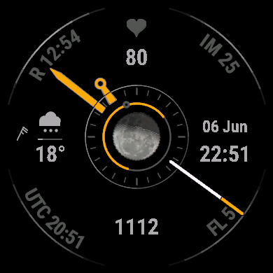

# Moonkey

An analog [Connect IQ](https://developer.garmin.com/connect-iq/) watch face for AMOLED Garmin
watches (MARQ 2, fenix 8), written in Monkey C. A real Moon at the centre — phase-shaded
and tilted to match the sky — inside a 24-hour day/night ring, with amber hands and a ring of
data fields.

<p align="center">
  
</p>

## Features

- **Moon** — a real lunar photo, soft-terminator shaded for the current phase and rotated to the
  true sky inclination for your location (bright-limb position angle − parallactic angle), all
  baked into a cached bitmap once per hour so each frame is a cheap blit. Position comes from a
  Meeus lunar series (verified against the `solunar` ephemeris), and a thin arc around the disc
  traces the Moon's above-horizon span (moonrise→moonset).
- **24-hour day/night ring** — midnight at top, noon at bottom; an amber arc spans daylight
  (computed sunrise→sunset), a pointer marks the current time, and a gradient "sun ring" peaks at
  the sun's meridian crossing. Optional **N/S compass markers** mark south and north on the ring
  (where the sun transits — hemisphere-aware).
- **Hands differentiated by silhouette** — hour is a tapered baton ending in an open ring, minute
  a tapered lance to a point, second a white shaft with an amber tip (optionally with a brushed-metal
  gradient). The slow hands creep smoothly; the seconds tick (1 Hz redraw budget).
- **Configurable** (Garmin Connect app settings) — accent & data colours, **moon-arc colour**, the
  **moon image** (moon, cat, fox, polar bear or seal), optional **metal-look hands**, a **second-tick
  track** (colour, or off — off by default), **N/S markers**, a **radial-gradient** toggle, **per-field small fonts**, a world **timezone**
  (17 zones, automatic DST), and **seven complication slots** (five data fields + weather + clock):
  pick a complication per slot, **hide any**, or choose a special mode — **Persian Solar date + Tehran
  clock** (E or S), **weather** icon+temp (N/S), **date + weekday** (E), **steps + heart rate** (W), or
  **custom text** (N). All from Garmin Connect, on every device.
- **Data fields** — five of them are the configurable complications above (defaulting to heart
  rate, steps, intensity minutes, floors, and sunrise/sunset); plus date, time, and weather: an
  icon (clear / cloud / rain / snow / storm / fog), temperature, a precipitation-chance bar, and a
  meteorological **wind barb** (knots).
- **Always-on aware** — keeps colours (the OS dims and pixel-shifts) but drops decorative,
  pixel-hungry elements (Moon, second hand, sun ring, N/S markers, wind barb, …) in low-power mode.
  Self-corrects if the watch ever drops the wake event (a known AMOLED quirk), so it can't get stuck
  dimmed.

## Targets

AMOLED, `minApiLevel 4.2.1`: `marq2aviator` (default), `fenix843mm`, `fenix847mm`, `marq2`, `venu3`, `epix2pro47mm`, `epix2`, `fr965`.

## Build & run

The SDK is managed by `connect-iq-sdk-manager-cli` (an open-source CLI replacement for the GUI SDK
Manager). With the toolchain set up (`setup-connectiq.sh`):

```bash
make run                      # build + load the default device into the simulator
make run DEVICE=fenix847mm    # ...a specific device (use sim-restart to switch a running sim)
make all                      # build a .prg for every target
make install DEVICE=marq2     # sideload the "Moonkey Dev" variant (separate app id; coexists with a store/beta install)
make uninstall                # remove sideloaded Moonkey from the watch (all builds)
make moon                     # regenerate the Moon bitmap from data/moon-raw.jpg
```

Sources live in `src/` (`MoonkeyApp.mc`, `AnalogView.mc`, `Astro.mc`, `CalendarMath.mc`); `make` targets are in the `Makefile`. `make shot DEVICE=<id>` builds, runs, waits for the face to render and screenshots it; override any setting for a run via env vars, e.g. `moonImage=1 make run` (cat).

## Documentation

- [agent_docs/architecture.md](agent_docs/architecture.md) — full design and render pipeline.
- [agent_docs/settings.md](agent_docs/settings.md) — every app setting, its options and default (generated by `make settings-doc`).
- [agent_docs/perf-analysis.md](agent_docs/perf-analysis.md) — the 128 KB / per-frame budget and optimizations.
- [agent_docs/finding-config.md](agent_docs/finding-config.md) — accent/timezone configurability research.
- [CLAUDE.md](CLAUDE.md) — build details, design notes, and gotchas.
